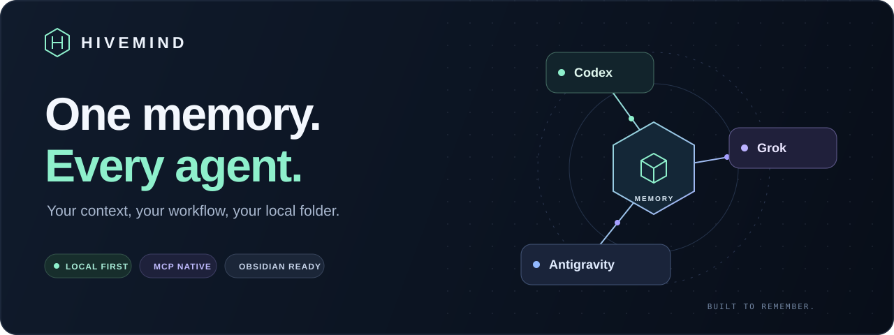
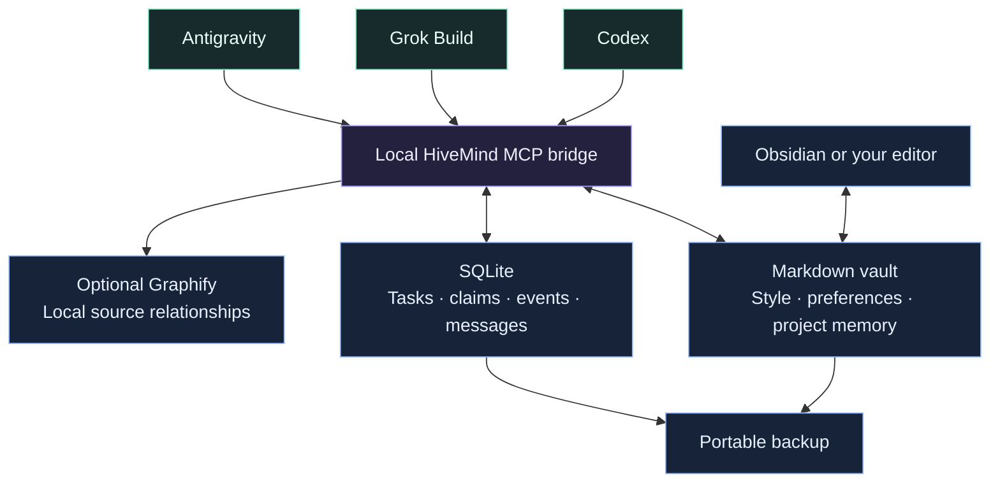

<div align="center">



**Shared memory for Codex, Grok Build, and Antigravity on one device.**<br>
Keep your preferences, project context, and hard-won solutions in one local folder.

    [](LICENSE)

[Quick start](#quick-start) · [How it works](#how-it-works) · [Your memory](#your-memory) · [Backups](#back-up--move-devices) · [Documentation](#documentation)

</div>

---

## The idea

You finish a task in Codex. Later, Grok opens the same project and retrieves what
changed, why it changed, and what still needs attention. In your next project,
confirmed preferences and relevant solutions are available again.

HiveMind makes that handoff possible through **shared files and a local MCP server**.
It gives each agent a small, relevant brief and a place to save what it learns.

**HiveMind is single-device software.** One Markdown vault and one SQLite database
serve the agents working on that computer. There is no device-sync requirement,
sync daemon, hosted memory bill, or cross-device conflict to resolve. Move to a
different computer with a backup when needed; do not run two active copies of the
same Hive. Existing remote connectors remain optional legacy paths, not the core
product.

| Remember | Coordinate | Own |
| :--- | :--- | :--- |
| Shared personality and working style | Targeted messages between agents | Plain Markdown you can edit |
| Confirmed preferences across projects | Tasks with explicit ownership | Local SQLite task history |
| Project decisions and verified solutions | Concise, persistent handoffs | Portable backups without hosting |
| Saved note versions and local audits | Searchable task and session history | One SQLite authority on this device |

**Now with budgeted briefs and resumable sessions:** select a context budget,
retrieve complete project-aware excerpts, and carry structured checkpoints between
agents. The optional CLI wrapper also captures Git state when an agent exits.
[Explore context & sessions →](docs/context-and-sessions.md)

**Optional code intelligence:** Graphify builds a local map of code relationships.
Agents query it through one bounded HiveMind tool, with no indexing model or API key.
[Explore local code graphs →](docs/code-graphs.md)

**Optional semantic recall:** a local embedding model can find a past solution even
when your new question uses different words. It joins keyword search inside the
existing memory tools; the vault remains plain Markdown.
[Explore semantic memory →](docs/semantic-memory.md)

> **Local memory, normal agent accounts.** HiveMind needs no hosting subscription
> or embedding service. Semantic recall is an optional local model downloaded once.
> Your AI agents still use their own services and account allowances. Retrieved
> memory uses normal context tokens.

## Quick start

You need **Python 3.11+**, **Git**, and at least one supported agent CLI installed
and signed in. The first setup downloads the Python dependencies. This source
repository is public, so cloning it needs no GitHub sign-in. Your personal vault
and device credentials remain local and are excluded from Git.

### 1 · Get HiveMind and enroll your project

Open **CMD in the project you want to work on**, then run:

```cmd
git clone https://github.com/raj45681/HiveMind.git "%USERPROFILE%\HiveMind" && "%USERPROFILE%\HiveMind\hivemind.cmd"
```

Already have HiveMind installed? From any project's CMD prompt:

```cmd
"%USERPROFILE%\HiveMind\hivemind.cmd"
```

Or specify the project explicitly:

```cmd
"%USERPROFILE%\HiveMind\hivemind.cmd" "D:\Projects\My App"
```

To include **local Graphify code indexing** (Python 3.12+, first setup downloads dependencies):

```cmd
"%USERPROFILE%\HiveMind\hivemind.cmd" "D:\Projects\My App" --with-graphify
```

To include **local semantic memory** (first setup downloads an isolated model):

```cmd
"%USERPROFILE%\HiveMind\hivemind.cmd" "D:\Projects\My App" --with-semantic
```

Once installed on the coordinator device, semantic recall works for **every
enrolled project** through the existing `memory_search` and `hive_context` tools.
No agent skill or extra MCP tool is needed. Combine both flags if you want
Graphify as well. [Setup, privacy and limits →](docs/semantic-memory.md)

Run the same command for each new project **on this device**. Source-only graphs
are rebuilt locally; preferences and handoffs stay in the same vault. Memory-only
setup still works without Graphify. [Supported files, limits and recovery →](docs/code-graphs.md)

<details>
<summary><strong>PowerShell and Linux commands</strong></summary>

PowerShell, after cloning to your home folder:

```powershell
& "$HOME\HiveMind\hivemind.cmd"
```

Linux, from your project's folder:

```bash
git clone https://github.com/raj45681/HiveMind.git "$HOME/HiveMind" && python3 "$HOME/HiveMind/bootstrap.py"
```

Subsequent projects:

```bash
python3 "$HOME/HiveMind/bootstrap.py"
```

Linux may need its distribution's Python `venv` package. Windows has been tested
locally; the portable code has not yet been exercised on a physical Linux device.

</details>

### 2 · Restart your agent session

Setup registers the `hivemind` MCP bridge with installed Codex, Grok Build, and
Antigravity CLIs. It adds a managed workflow to `AGENTS.md`, handles an existing
`AGENTS.override.md`, and adds a pointer to an existing `GEMINI.md`.

Existing instructions are preserved and backed up. Reruns update the managed
section without duplicating it. Accept normal project-trust and MCP prompts;
Grok must trust the project before loading its rules. Missing CLIs are skipped.

### 3 · Work as usual

Agents are instructed to retrieve context before substantial work, save verified
learning at milestones, and leave a handoff. You do not need to repeat
“use HiveMind” for every task in an enrolled project.

**This is an instruction-based workflow.** Agents must follow the rules and have
access to the tools. HiveMind does not silently capture every chat, guarantee
model compliance, or automatically launch another agent.

## How it works



| When | What happens |
| :--- | :--- |
| **Start a task** | Fetch a bounded brief: shared style, confirmed preferences, project state, and relevant search matches. |
| **Reach a milestone** | Record a verified solution, reusable procedure or scoped decision with its source and evidence. |
| **Finish work** | Update project state and leave a concise handoff for the next agent. |
| **Switch projects** | Reuse confirmed preferences; search for applicable past solutions. Project choices stay scoped. |

**Small context by design:** configurable briefs (default 1800 estimated tokens),
complete excerpts ranked by project, relevance and freshness, revision-checked writes,
and no model-driven queue polling. Optional semantic search runs local embedding
inference only; it makes no paid agent or hosted API calls. Other search and
coordination remain deterministic;
reading the returned text still consumes context. Inferred tastes stay separate
from confirmed preferences. Current instructions always take precedence over memory.

Candidate review, checkpoint review, procedure maintenance, history, audit and older
handoff search are **on demand**. They do not expand the default brief or add MCP
tools. Agents can save verified procedures through the existing `memory_learn` tool;
inferred preferences need explicit local approval before they enter the profile.
[Use local memory operations →](docs/local-memory-operations.md)

### One server, up to 17 tools

HiveMind registers **one MCP server** with each agent. That server exposes 16 core
tools, plus `code_query` on devices with Graphify-enabled projects:

| Purpose | Tools | Count |
| :--- | :--- | ---: |
| Memory | `hive_context`, `memory_search`, `note_read`, `memory_write`, `memory_learn` | 5 |
| Sessions | `session_start`, `session_checkpoint`, `session_resume` | 3 |
| Tasks | `task_create`, `task_get`, `task_list`, `task_claim`, `task_heartbeat`, `task_finish` | 6 |
| Messages | `message_send`, `message_inbox` | 2 |
| Optional code graph | `code_query` | 1 |

The MCP `tools/list` response distinguishes reads from writes with explicit
`readOnlyHint` annotations. New sessions, tasks and messages are marked additive;
checkpoints, memory updates and task-state changes are marked as mutations.
`code_query` can refresh its disposable local index, so it is marked as a
non-destructive write even though it does not edit source files. These are client
hints, not an access-control boundary; the server still validates every write.

Task and messaging tools support explicit coordination; their presence does not
launch other agents. All 16 core tools are currently exposed. A smaller tool profile
is a proposed optimization, not an available setting yet.

**When Graphify runs:** setup with `--with-graphify` builds the initial index.
Subsequent `code_query` calls check for source changes and refresh as needed.
It does not run continuously or after every message. Agents are instructed to use
it for code relationships; preferences and handoffs use the memory/session tools.
[Invocation details →](docs/code-graphs.md#when-graphify-runs)

**Token overhead:** semantic indexing uses your CPU, not agent tokens. Tool definitions,
project instructions and returned text still add context to the agent. The 1,800-token
memory brief and 1,000-token code-query defaults are approximate response ceilings,
not fixed per-task charges or limits on the entire conversation. Actual usage depends
on the harness, tokenizer, caching and number of calls. Net savings from fewer file
reads have not yet been measured in a paid-agent task.

## Your memory

```text
HiveMind/
├── hivemind.cmd          Windows project installer
├── bootstrap.py          Portable first-run setup
├── hive.py               CLI + MCP entry point
├── hivemind/             Memory, coordination, and execution
├── templates/vault/      Generic starter notes tracked in Git
├── vault/                Your private local notes — ignored by Git
│   ├── 00-System/        Personality and working style
│   ├── 01-Memory/        Preferences and reusable solutions
│   ├── 02-Decisions/     Decisions and reasons
│   ├── 03-Projects/      Project state and handoffs
│   ├── 04-Tasks/         Generated task views
│   └── 05-Agents/        Agent roles
├── runtime/              Private SQLite database, note versions, logs, and config backups
└── tests/                Automated tests without paid inference
```

Open **`vault/` as an Obsidian vault**, then open `START`. No community plugin is
required, and Obsidian does not need to be running. Edit `00-System/Personality.md`
and `00-System/Working-Style.md` to define how your agents should work.

Session checkpoints retain completed work, reported checks, blockers and next
steps in SQLite, with a Markdown view under each project's `Sessions/` directory.
Concurrent updates require revision checks, and a CLI exit alone is never treated
as verified completion. Resume compares each saved Git/worktree fingerprint with
the live state and flags changed or unverifiable handoffs for inspection.
[Session behavior and limitations](docs/context-and-sessions.md).

Saved Markdown revisions can be inspected, diffed and restored with a current-revision
check. A read-only audit flags mechanical issues; an opt-in search finds older task,
session and message handoffs. These local operations make no model calls.
[Commands and limits →](docs/local-memory-operations.md)

The repository ships generic templates. First setup creates missing local notes
without replacing your edits. **Your real vault, credentials, databases, device
configuration, and backup ZIPs are excluded from Git.** Cloning this repository
installs the software; it does not restore your personal memory.

## Back up & move devices

From your HiveMind folder, after stopping active agent sessions and task workers:

```cmd
.venv\Scripts\python.exe hive.py backup "D:\Backups\HiveMind-2026-09-25.zip"
```

Choose a new filename each time. Existing backups are never overwritten.

| Included in a personal backup | Recreated or transferred separately |
| :--- | :--- |
| Source and starter templates | Python environment and dependencies |
| Vault notes and attachments | Agent logins and credentials |
| Consistent SQLite snapshot | Device-specific repository paths |
| Task history and messages | Working code, worktrees, run logs, and cloud cache |

Extract the ZIP's `HiveMind` folder onto the next device. Install Python and your
agent CLIs, then run its installer in each project. Keep the project's tracked
`.hivemind/project.json` to preserve its identity. Restart agent sessions.

**Use one active copy.** Moving devices is migration, not live synchronization.
Move a fresh backup when switching devices; do not sync a live SQLite database
with a generic folder-sync tool. Personal backups contain private data—keep them
out of GitHub releases and repository commits.

## Useful commands

Run these from your HiveMind folder. On Linux substitute `.venv/bin/python`.

```cmd
.venv\Scripts\python.exe hive.py doctor
.venv\Scripts\python.exe hive.py status
.venv\Scripts\python.exe hive.py search "authentication"
.venv\Scripts\python.exe hive.py offline
.venv\Scripts\python.exe hive.py context myapp --query "login" --budget 1000
.venv\Scripts\python.exe hive.py resume myapp
.venv\Scripts\python.exe hive.py history "01-Memory/Solutions/my-fix.md"
.venv\Scripts\python.exe hive.py memory-audit --project myapp
.venv\Scripts\python.exe hive.py handoff-search "authentication" --project myapp
```

The installer supports `--dry-run`, `--name myapp`, and `--skip-register`.

For an explicitly launched interactive session with automatic exit capture:

```cmd
.venv\Scripts\python.exe hive.py session-run myapp codex
```

This uses the agent's normal account usage. Substitute `grok` or `antigravity`.
Normal agent launches still work; their handoff capture depends on following the
installed instructions. The context budget is an estimate for the returned brief,
not a hard limit on the agent's full conversation or account usage.

<details>
<summary><strong>Optional: explicitly queue and run an agent task</strong></summary>

```cmd
.venv\Scripts\python.exe hive.py create examples\inspect-project.json
.venv\Scripts\python.exe hive.py run TASK-ID --dry-run
```

Replace `TASK-ID` with the returned ID. Remove `--dry-run` only when you intend
to execute the task using the assigned agent's account. Creating tasks or sending
messages does not wake a model.

Tasks use claims and leases to prevent duplicate ownership. Write tasks require
a clean Git repository with a committed HEAD and run in an isolated worktree.
Expired tasks block for inspection and explicit requeue. Reported evidence needs
review; nothing automatically merges, pushes, or deploys code.

</details>

## Development

```cmd
.venv\Scripts\python.exe -m unittest discover -s tests -v
```

Tests cover memory conflicts, ownership and leases, worker result handling, MCP
interoperability, project-rule preservation, offline routing, backup restoration,
and private-vault separation. They use temporary fixtures and no paid model calls.

The protocol suite verifies tool behavior, not a model's instruction compliance.
Real vendor inference and physical Linux behavior need separate smoke tests.

## Documentation

| Guide | Read it for |
| :--- | :--- |
| [Budgeted context & session handoffs](docs/context-and-sessions.md) | Smaller briefs, checkpoints, resume, and optional CLI exit capture |
| [Optional local code graphs](docs/code-graphs.md) | Graphify setup, bounded queries, supported files and fallback behavior |
| [Optional semantic memory](docs/semantic-memory.md) | Paraphrase recall, one-time model setup, local index and limits |
| [Local memory inspection](docs/local-memory-operations.md) | Note history, safe restore, read-only audit, and handoff search |
| [Device migration](docs/new-device.md) | Moving a local Hive with a backup; legacy remote configuration |
| [Optional cloud bridge](docs/cloud-memory.md) | Legacy cloud integration; inactive in local mode |
| [Implementation references](docs/sources.md) | Protocol and CLI references |
| [Agent workflow](AGENTS.md) | Instructions used when developing HiveMind |

## License

HiveMind is licensed under the [MIT License](LICENSE). Keep the copyright and
license notice when redistributing it. Installed third-party dependencies retain
their own licenses.

---

<div align="center">

**Keep the context. Carry the learning. Choose the agent.**

Markdown you can read · SQLite you can back up · A folder you control

</div>
