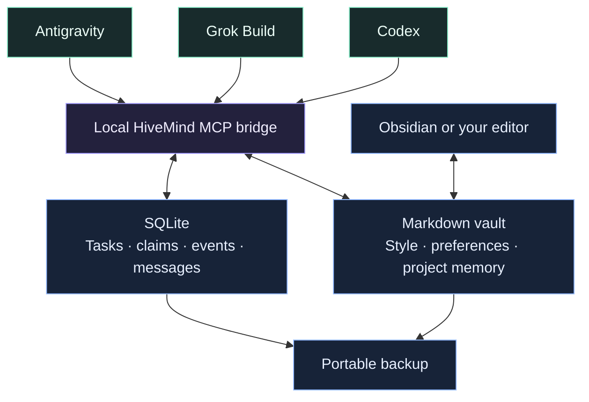

<div align="center">


**Shared memory for Codex, Grok Build, and Antigravity.**<br>
Keep your preferences, project context, and hard-won solutions in one local folder.

   

[Quick start](#quick-start) · [How it works](#how-it-works) · [Your memory](#your-memory) · [Move devices](#back-up--move-devices) · [Documentation](#documentation)

</div>

---

## The idea

You finish a task in Codex. Later, Grok opens the same project and retrieves what
changed, why it changed, and what still needs attention. In your next project,
confirmed preferences and relevant solutions are available again.

HiveMind makes that handoff possible through **shared files and a local MCP server**.
It gives each agent a small, relevant brief and a place to save what it learns.

| Remember | Coordinate | Own |
| :--- | :--- | :--- |
| Shared personality and working style | Targeted messages between agents | Plain Markdown you can edit |
| Confirmed preferences across projects | Tasks with explicit ownership | Local SQLite task history |
| Project decisions and verified solutions | Concise, persistent handoffs | Portable backups without hosting |

> **Local memory, normal agent accounts.** HiveMind needs no hosting subscription,
> embedding service, or additional model. Your AI agents still use their own
> services and account allowances. Retrieved memory uses normal context tokens.

## Quick start

You need **Python 3.11+**, **Git**, and at least one supported agent CLI installed
and signed in. The first setup downloads the Python dependencies. Private
repositories require your GitHub authentication to clone.

### 1 · Get HiveMind and enroll your project

Open **CMD in the project you want to work on**, then run:

```cmd
git clone https://github.com/raj45681/HiveMind.git "%USERPROFILE%\HiveMind" && "%USERPROFILE%\HiveMind\hivemind.cmd"
```

Already have HiveMind installed? From any project's CMD prompt:

```cmd
"%USERPROFILE%\HiveMind\hivemind.cmd"
```

Or specify the project explicitly:

```cmd
"%USERPROFILE%\HiveMind\hivemind.cmd" "D:\Projects\My App"
```

<details>
<summary><strong>PowerShell and Linux commands</strong></summary>

PowerShell, after cloning to your home folder:

```powershell
& "$HOME\HiveMind\hivemind.cmd"
```

Linux, from your project's folder:

```bash
git clone https://github.com/raj45681/HiveMind.git "$HOME/HiveMind" && python3 "$HOME/HiveMind/bootstrap.py"
```

Subsequent projects:

```bash
python3 "$HOME/HiveMind/bootstrap.py"
```

Linux may need its distribution's Python `venv` package. Windows has been tested
locally; the portable code has not yet been exercised on a physical Linux device.

</details>

### 2 · Restart your agent session

Setup registers the `hivemind` MCP bridge with installed Codex, Grok Build, and
Antigravity CLIs. It adds a managed workflow to `AGENTS.md`, handles an existing
`AGENTS.override.md`, and adds a pointer to an existing `GEMINI.md`.

Existing instructions are preserved and backed up. Reruns update the managed
section without duplicating it. Accept normal project-trust and MCP prompts;
Grok must trust the project before loading its rules. Missing CLIs are skipped.

### 3 · Work as usual

Agents are instructed to retrieve context before substantial work, save verified
learning at milestones, and leave a handoff. You do not need to repeat
“use HiveMind” for every task in an enrolled project.

**This is an instruction-based workflow.** Agents must follow the rules and have
access to the tools. HiveMind does not silently capture every chat, guarantee
model compliance, or automatically launch another agent.

## How it works



| When | What happens |
| :--- | :--- |
| **Start a task** | Fetch a bounded brief: shared style, confirmed preferences, project state, and relevant search matches. |
| **Reach a milestone** | Record a verified solution or scoped decision with its source and evidence. |
| **Finish work** | Update project state and leave a concise handoff for the next agent. |
| **Switch projects** | Reuse confirmed preferences; search for applicable past solutions. Project choices stay scoped. |

**Small context by design:** SQLite search, bounded excerpts, revision-checked writes,
and no model-driven queue polling. Search and coordination make no inference calls;
reading the returned text still consumes context. Inferred tastes stay separate
from confirmed preferences. Current instructions always take precedence over memory.

## Your memory

```text
HiveMind/
├── hivemind.cmd          Windows project installer
├── bootstrap.py          Portable first-run setup
├── hive.py               CLI + MCP entry point
├── hivemind/             Memory, coordination, and execution
├── templates/vault/      Generic starter notes tracked in Git
├── vault/                Your private local notes — ignored by Git
│   ├── 00-System/        Personality and working style
│   ├── 01-Memory/        Preferences and reusable solutions
│   ├── 02-Decisions/     Decisions and reasons
│   ├── 03-Projects/      Project state and handoffs
│   ├── 04-Tasks/         Generated task views
│   └── 05-Agents/        Agent roles
├── runtime/              Private database, logs, and config backups
└── tests/                Automated tests without paid inference
```

Open **`vault/` as an Obsidian vault**, then open `START`. No community plugin is
required, and Obsidian does not need to be running. Edit `00-System/Personality.md`
and `00-System/Working-Style.md` to define how your agents should work.

The repository ships generic templates. First setup creates missing local notes
without replacing your edits. **Your real vault, credentials, databases, device
configuration, and backup ZIPs are excluded from Git.** Cloning this repository
installs the software; it does not restore your personal memory.

## Back up & move devices

From your HiveMind folder, after stopping active agent sessions and task workers:

```cmd
.venv\Scripts\python.exe hive.py backup "D:\Backups\HiveMind-2026-09-25.zip"
```

Choose a new filename each time. Existing backups are never overwritten.

| Included in a personal backup | Recreated or transferred separately |
| :--- | :--- |
| Source and starter templates | Python environment and dependencies |
| Vault notes and attachments | Agent logins and credentials |
| Consistent SQLite snapshot | Device-specific repository paths |
| Task history and messages | Working code, worktrees, run logs, and cloud cache |

Extract the ZIP's `HiveMind` folder onto the next device. Install Python and your
agent CLIs, then run its installer in each project. Keep the project's tracked
`.hivemind/project.json` to preserve its identity. Restart agent sessions.

**Use one active copy.** Offline copies do not automatically synchronize or merge.
Move a fresh backup when switching devices; do not sync a live SQLite database
with a generic folder-sync tool. Personal backups contain private data—keep them
out of GitHub releases and repository commits.

## Useful commands

Run these from your HiveMind folder. On Linux substitute `.venv/bin/python`.

```cmd
.venv\Scripts\python.exe hive.py doctor
.venv\Scripts\python.exe hive.py status
.venv\Scripts\python.exe hive.py search "authentication"
.venv\Scripts\python.exe hive.py offline
```

The installer supports `--dry-run`, `--name myapp`, and `--skip-register`.

<details>
<summary><strong>Optional: explicitly queue and run an agent task</strong></summary>

```cmd
.venv\Scripts\python.exe hive.py create examples\inspect-project.json
.venv\Scripts\python.exe hive.py run TASK-ID --dry-run
```

Replace `TASK-ID` with the returned ID. Remove `--dry-run` only when you intend
to execute the task using the assigned agent's account. Creating tasks or sending
messages does not wake a model.

Tasks use claims and leases to prevent duplicate ownership. Write tasks require
a clean Git repository with a committed HEAD and run in an isolated worktree.
Expired tasks block for inspection and explicit requeue. Reported evidence needs
review; nothing automatically merges, pushes, or deploys code.

</details>

## Development

```cmd
.venv\Scripts\python.exe -m unittest discover -s tests -v
```

Tests cover memory conflicts, ownership and leases, worker result handling, MCP
interoperability, project-rule preservation, offline routing, backup restoration,
and private-vault separation. They use temporary fixtures and no paid model calls.

The protocol suite verifies tool behavior, not a model's instruction compliance.
Real vendor inference and physical Linux behavior need separate smoke tests.

## Documentation

| Guide | Read it for |
| :--- | :--- |
| [New devices & optional remote coordination](docs/new-device.md) | Moving a local Hive or explicitly connecting a private coordinator |
| [Optional cloud bridge](docs/cloud-memory.md) | Legacy cloud integration; inactive in local mode |
| [Implementation references](docs/sources.md) | Protocol and CLI references |
| [Agent workflow](AGENTS.md) | Instructions used when developing HiveMind |

---

<div align="center">

**Keep the context. Carry the learning. Choose the agent.**

Markdown you can read · SQLite you can back up · A folder you control

</div>
